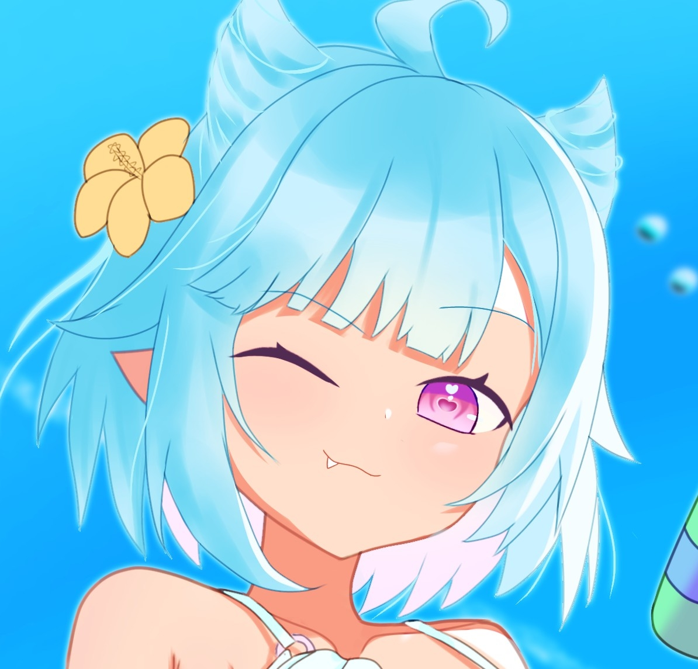

<!DOCTYPE html>
<html lang="ja">
<head>
  <meta charset="UTF-8" />
  <meta name="viewport" content="width=device-width, initial-scale=1.0" />
  <title>しぐまのボタン</title>
  <link href="https://fonts.googleapis.com/css2?family=Noto+Sans+JP&display=swap" rel="stylesheet">
  
</head>
<body>

  
  <h1>しぐまのボタン</h1>

  

    <button onclick="playVoice('voice01.mp3')">まっずいこれ</button>
    <button onclick="playVoice('voice02.mp3')">怖すぎるぅぅぅ</button>
    <button onclick="playVoice('voice03.mp3')">ヤバすぎるこれ</button>
  

  <audio id="player"></audio>

  <!-- 🐟 漂う絵文字たち -->
  
🪼

  
🐟

  
🦑

  
🐠

  
🩵
 <!-- クリオネ風！ -->

  

</body>
</html>
